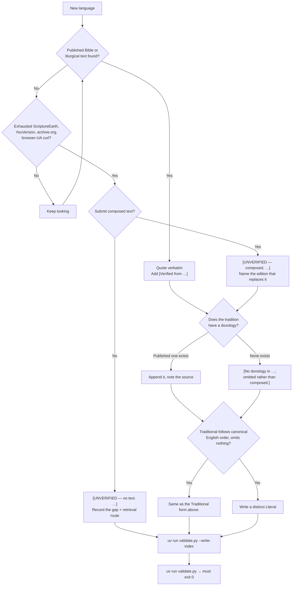

# Contributing

This repo collects the Lord's Prayer in as many languages as can be sourced honestly. The hard part is not the file format — it is knowing what counts as a real translation and what to do when one does not exist. Most of this document is about that.

Before opening a PR:

```bash
uv run validate.py --write-index   # rebuild prayer/INDEX.md from the files on disk
uv run validate.py                 # must exit 0
```

## The file format

One file per language, named for the language **in English**, inside the shard directory its first letter selects — `prayer/[shard]/[Language].txt`. The English name is the filename; the language's own name goes inside.

Do not work out the shard by hand. `uv run validate.py` tells you if a file is in the wrong one, and the generator places new files itself.

```
Deutsch                                          ← line 1: autonym in its native script,
                                                 ←   or exactly [autonym not recorded]
                                                 ← line 2: blank
=== Traditional ===                              ← line 3: exactly this
Vater unser im Himmel,                           ← the recognized liturgical wording
geheiligt werde dein Name.
…
                                                 ← blank line
Denn dein ist das Reich …  Amen.                 ← doxology, its own paragraph
                                                 ← blank line
=== Literal (mirrors the canonical English) ===  ← exactly this, parenthetical included
Same as the Traditional form above.
```

Rules the validator enforces:

- UTF-8, no BOM, LF line endings, exactly one trailing newline, no trailing blank line.
- No tabs, no trailing whitespace, no two consecutive blank lines.
- Line 1 is the autonym, or exactly `[autonym not recorded]`; either way it is not empty. Line 2 is blank. Line 3 is `=== Traditional ===`.
- Exactly two section headers, Traditional first, both spelled exactly as above.
- The Traditional section has at least two paragraphs — the prayer, then the doxology.
- The Literal section is not empty. Its internal shape is deliberately unconstrained; several languages legitimately vary it.
- Filenames are ASCII, NFC-normalised, and use a plain ASCII apostrophe (`K'iche'.txt`).

Autonyms use a parenthetical only to disambiguate or romanize: `Akan (Twi)`, `客家話 (Hak-kâ-fa)`, `کٲشُر (कॉशुर)`. Use it too where a language is digraphic and the edition prints the romanised form.

## When no autonym is recorded

Do not guess line 1, and do not fall back on the English name — a fallback is indistinguishable from a genuine autonym that happens to equal the exonym, and the corpus has several of those (*Warlpiri*, *Tem*, *Oniyan*, *Gikyode*). Write exactly:

```
[autonym not recorded]
```

Use it when no consulted source records a name the speakers use for the language. **A reference name is not an autonym**, and neither is an English alternative name, an English geographic qualifier (*Eastern Kalagan*), an SIL inverted form (*Buang, Central/Mapos*), a country name, or a gloss in a national language (*bahasa Amarasi* names the language in Indonesian, not in Amarasi).

The marker says nothing about the prayer text in that file, which is sourced and verified like any other.

If you can supply a real autonym, replace the marker and **name the source in the pull request, not in the file**. `(Source: …)` and `[Verified …]` inside a file mean the *prayer text's* provenance and are counted as such by the validator.

## Where the text must come from

**Tier 1 — a published Bible translation** of Matthew 6:9–13, quoted verbatim. Name the edition, publisher and year.

**Tier 2 — an established liturgical text** of that tradition: a missal, prayer book, catechism or service book, quoted verbatim.

**Tier 3 — a reputable secondary compilation** (Omniglot, the christusrex *Pater Noster* collection, Wikipedia), and only when the underlying edition can be named. "Found on a prayer website" is not a source.

**Never acceptable:** machine translation, back-translation from English, or text taken from a *related* language.

> **The worked example.** The "Central Atlas Tamazight" Lord's Prayer circulating online — including on prayer aggregator sites — is in fact **Kabyle**, a different language. Anyone assembling this repo from secondary sources would have filed it under Tamazight and been wrong. `Central Atlas Tamazight.txt` records the trap; `Kabyle.txt` holds the actual Kabyle text. Check that a secondary source's language label matches the ISO code and the script you expect.

Record the source as the first line of the Traditional section, followed by a blank line:

```
[Verified from the Dogri New Testament (नमां नियम, Free Bibles India / Bible Society work), Matthew 6:9-13.]
```

**Only cite an edition the text actually came from.** If you are adding provenance to an existing file rather than a new one, verify it first:

```bash
uv run scripts/verify_provenance.py Somali        # compare against published editions
uv run scripts/verify_provenance.py --apply       # record only exact matches
```

The tool compares the file's wording against Matthew 6:9–13 in every eBible edition for that language and reports how many words differ. It writes a source line only on an exact word-for-word match. A near miss means the text came from somewhere else — a liturgy, or a different printing — and must not be attributed to the edition tested.

## When no published text exists

This is the situation that produces bad data, so the rules are strict.

**You may submit composed text, but it must be labelled.** Put the marker as the first line of the section it applies to, and make `composed` the first thing it says:

```
[UNVERIFIED — composed, not a published translation. <Name the published edition that should replace this, and why it could not be retrieved.>]
```

Naming the edition matters: it turns a defect into a work item for whoever fixes it. `Magahi.txt` and `Bodo.txt` are the models — both name the exact fileset and publisher that should supersede them.

Use the variants when they fit: `[UNVERIFIED — partly composed. …]` when only some petitions are reconstructed, and `[UNVERIFIED — no text. …]` when you are submitting a record of the gap and no wording at all. `Tigre.txt` is the model for the last case, and it is a perfectly good contribution — an honest gap with a retrieval route beats invented scripture.

**Before concluding a text cannot be retrieved,** try ScriptureEarth (downloadable USFM and PDF, which bypass JavaScript readers), YouVersion's version list for the ISO code, archive.org, and a plain `curl` with a browser User-Agent. Several existing gaps in this repo exist only because a Bible.is reader is a JavaScript app behind a key-gated API — not because the translation is missing.

## The doxology

The canonical form includes "For thine is the Kingdom, Power and Glory, now and forever. Amen." Many traditions — most Catholic forms, and the shorter Lukan form — do not.

If the tradition's standard text omits it, append a **published** doxology in that language: from the same Bible's other printing, from the liturgy's embolism, or from a Protestant edition. Mark where it came from.

**If no published doxology exists in that language, omit it and say so. Do not compose one.**

```
[No doxology in the Lukan form or in any published Banjar text; omitted rather than composed.]
```

`Banjar.txt` is the model. Its published Scripture covers only Luke and John, so it carries the shorter Lukan prayer verbatim and simply records that the remaining lines do not exist in Banjar.

## The Literal section

Use the exact string `Same as the Traditional form above.` only when the Traditional wording already follows the canonical English clause order and omits nothing. About four in five files qualify.

Supply a genuinely distinct Literal when the Traditional is a free or liturgical rendering that reorders, merges or drops clauses:

- `Spanish.txt` — the liturgical text reorders the kingdom/will clauses; the Literal restores canonical order.
- `Italian.txt` — the 2008 revision reads *non abbandonarci alla tentazione*; the Literal keeps the older *non indurci in tentazione*.
- `Japanese.txt` — Traditional is the Catholic 共同訳, Literal the Protestant 口語訳.
- `Cantonese.txt` — Traditional is the Chinese Union Version in written Mandarin; the Literal is genuine written Cantonese.

A short caveat may follow the boilerplate on the same line, in parentheses.

## Brackets versus parentheses

**Square brackets are editorial** — statements by the compiler about the text: `[Verified from …]`, `[UNVERIFIED — …]`, `[No doxology in …]`. This applies to line 1 as well: a bracketed line-1 value is an editorial statement, not a name, and `[autonym not recorded]` is the only one defined.

**Parentheses are supplementary** — part of the material itself: transliterations, script labels, textual-variant notes, and a trailing `(Source: …)` paragraph.

Never put prayer text in square brackets. A reader scanning for the prayer must be able to skip every `[…]` and lose nothing.

## How the sharding works

GitHub truncates any directory listing at 1,000 entries, and the Contents API does it *silently* — HTTP 200, no truncation flag, `?page=2` ignored. So prayer files live in letter-range directories, each far below that limit.

**A file's shard is a pure function of its filename.** Fold the stem to a key, then find the range whose lower bound it falls in:

```python
key = unicodedata.normalize("NFD", stem).lower()      # lowercase FIRST
key = "".join(c for c in key if not unicodedata.combining(c))
key = re.sub(r"^[^a-z]+", "", key)                    # 'Auhelawa -> auhelawa
```

Lowercasing must come before stripping. Strip first and you remove the initial capital of every name: `Ashaninka` → `shaninka`, filed under `s`.

**Membership is decided by the lower bound alone.** Shard *i* owns keys *k* where `lo_i ≤ k < lo_(i+1)`. The second letter in a name like `a-h` is *derived* from the next shard's lower bound and is decorative. That is what makes the ranges contiguous and exhaustive by construction, and it means a letter no language currently starts with still has a home.

**Boundaries are frozen data.** The directory names are the manifest. `validate.py` reads them and checks placement against them; it does not recompute them. This is deliberate — recomputing on every change would rename every directory whenever the shard count changed, moving the entire corpus. Adding a language never moves another file.

### Resharding

Only when a shard approaches the limit. `validate.py` warns above 800 files and errors at 1,000. On current proportions that is thousands of languages away.

```bash
uv run validate.py --reshard    # recompute the layout and move the files
git add -A                      # git detects the renames by content
```

Then commit **the moves and nothing else**. Exact renames are matched by blob hash, but change any file's bytes in the same commit and rename detection degrades — turning a reviewable move into an unreadable diff.

Resharding breaks every existing link to the old paths. That is the cost of doing it, which is why the boundaries are frozen rather than continuously rebalanced.

### Naming files in prose

Documentation names a file **without its shard** — write `Spanish.txt`, not the full path with the shard directory in it. A reshard would turn the second into a lie, and nothing would catch it. `validate.py` enforces both halves: a bare name must resolve to a real file, and a path with a shard in it is an error.

## Do not hand-edit `prayer/INDEX.md`

Its language list, count, and review-flag markers are generated from the files on disk. Run `uv run validate.py --write-index`.

The index is also the **only complete listing** of the corpus, since no directory view can show more than 1,000 languages. Its entries are links, and their targets are percent-encoded — an unencoded space makes Markdown render the line as literal text instead of a link. The title, preamble, canonical-text blockquote and Notes bullets are prose and are never touched by the generator — edit those by hand.

CI fails a PR whose index is out of date.

## Copyright

Submit only the five verses (Matthew 6:9–13), never a whole chapter. Always name the edition and rights holder. Do not submit text you lack the right to quote. See [NOTICE.md](NOTICE.md) for the repo's position and its rights-holder contact.

## Decision flow


